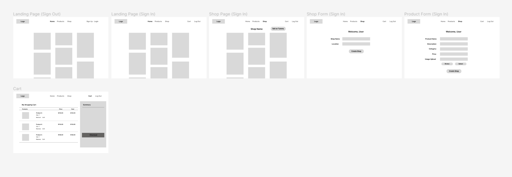
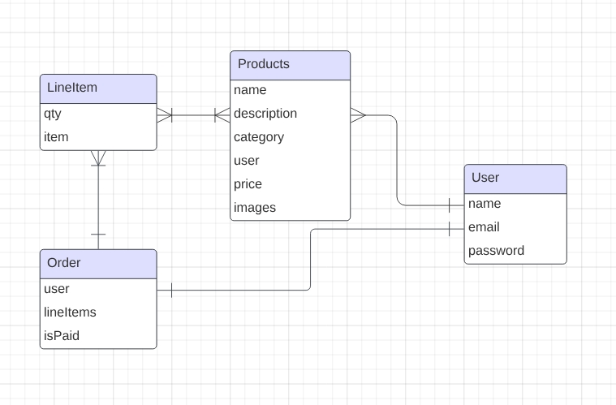
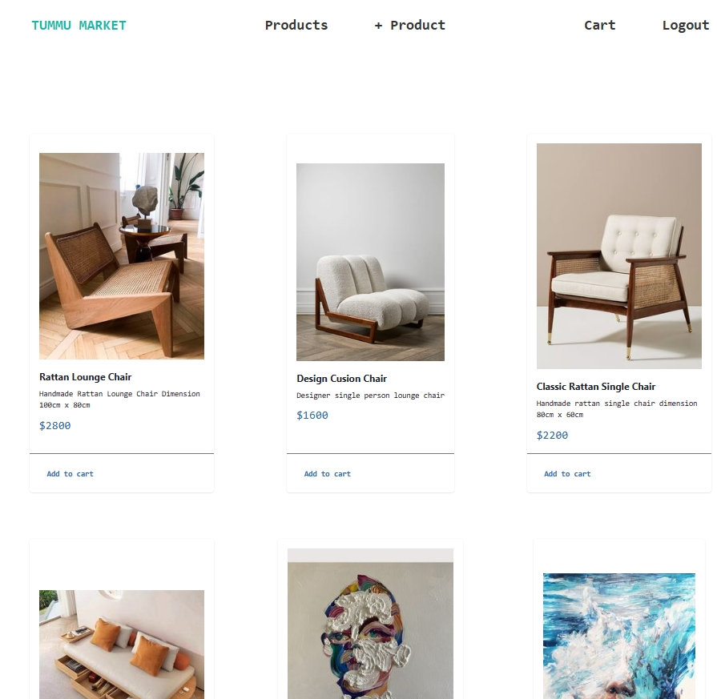

<!-- 

 -->
<!-- NEED NEW LOGO -->

# 🏪 Tummu Marketplace 🏪

This a multivendor ecommerce website project using MERN stack

## 👐 Introduction

Welcome to Tummu Market, your premier destination for handcrafted treasures from artisans worldwide. Our platform is a celebration of craftsmanship, offering a curated selection of unique products ranging from home decor to jewelry and gifts.

At Tummu Market, we bridge the gap between artisans and shoppers, showcasing the passion and skill behind each creation. With a diverse array of handmade goods, our marketplace reflects the rich tapestry of cultures and traditions, inviting you to explore and discover the stories behind every piece.

Join us in embracing the beauty of craftsmanship and making a meaningful impact with every purchase. Start your journey at Tummu Market, where every item tells a story and supports the talented artisans who bring them to life.

<!-- ## 🔎 Explore the App

Discover the refined version of the [TripMixer Travel App](https://sei-tripmixer.fly.dev/) now live on fly.io. -->

## 📝 Planning & Problem Solving 🚩

-   Laid out the ERD
-   Draw up wireframe
-   Using MERN-starter to build the project structure

## 📷 App Screenshots

## 🤖 Technology used:

-   MongoDB
-   Express
-   Node JS
-   React JS
-   Chakra UI
-   Tailwind CSS

## 💪 Challenges Faced and Conquered 💪

The whole react interface is a challenge to work with but I slowly become more accustomed and get each functionality working.
Challenging feature

-   Uploading images in React JS
-   Working with Tailwind CSS

## 🚀 Future features

-   Add web responsive with tailwind
-   Add category filter
-   Add 'Shop' features to display shop and products in the shop.
-   Add checkout features with stripe.
-   Add counter display on 'Cart' navbar when product is added to cart.
